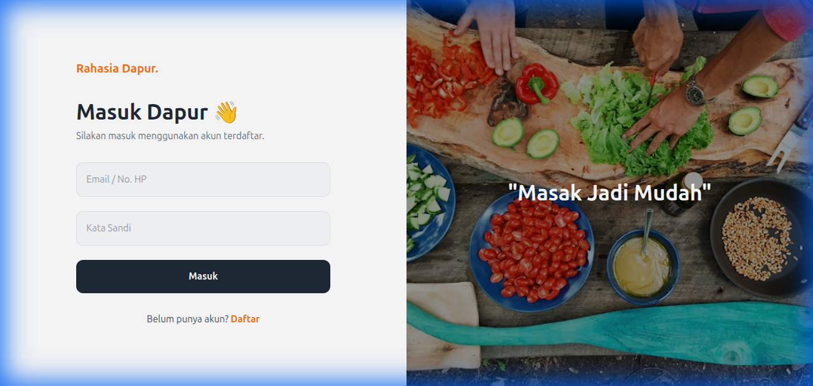
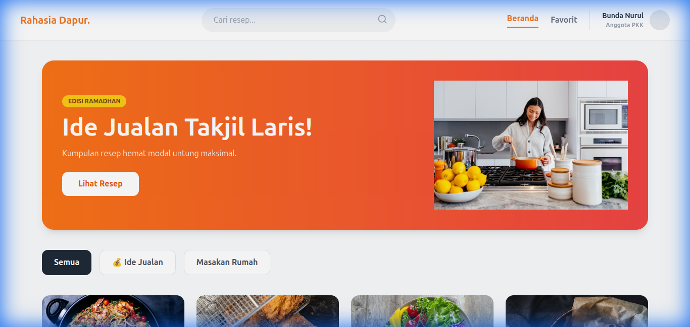
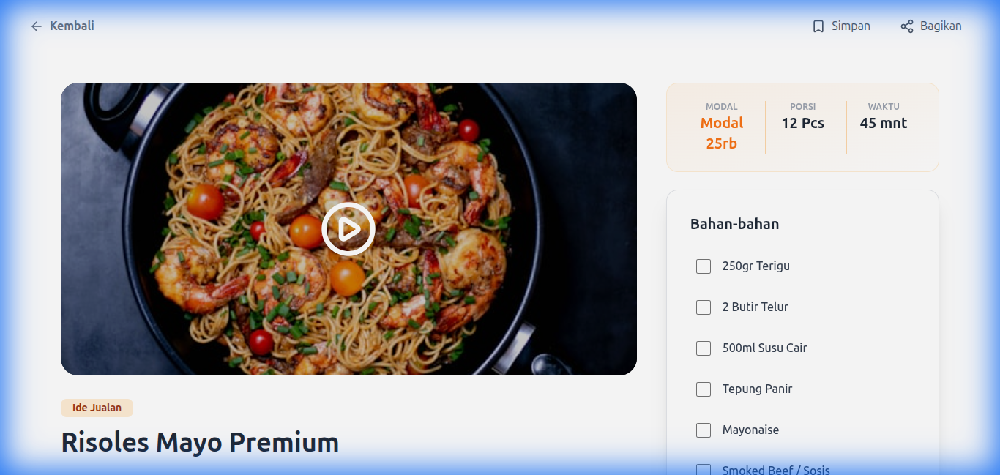

# 🍳 Rahasia Dapur


**Rahasia Dapur** adalah aplikasi kuliner *full-stack* yang dirancang untuk berbagi dan menemukan resep rahasia masakan. Platform ini terdiri dari Backend API yang handal, Frontend React yang modern, dan Aplikasi Mobile lintas platform yang dibangun dengan React Native.

---

## 📸 Tampilan Aplikasi (Screenshots)

### Frontend Web
| Halaman Login | Halaman Utama (Home) |
|:---:|:---:|
|  |  |

### Detail Resep (Web)


> **Screenshot Aplikasi Mobile**: Tambahkan di sini hasil tes dari perangkat fisik Anda.

---

## 🛠 Teknologi yang Digunakan (Tech Stack)

| Komponen | Teknologi | Deskripsi |
| :--- | :--- | :--- |
| **Backend** |   | REST API, Auth (JWT), Logika Bisnis |
| **Database** |  | Database NoSQL untuk User & Resep |
| **Frontend** |   | SPA Modern, Styling dengan Tailwind CSS |
| **Mobile** |   | Aplikasi Lintas Platform (Android/iOS) |

---

## 🚀 Panduan Instalasi (Getting Started)

Ikuti langkah-langkah berikut untuk menjalankan proyek di komputer lokal Anda.

### Prasyarat
-   Node.js (v16 atau lebih baru)
-   MongoDB (Running locally atau Compass)
-   Aplikasi Expo Go (di HP Anda untuk testing mobile)

### 1. Setup Backend
Server backend menangani semua data dan autentikasi.

```bash
cd backend_rahasia_dapur
npm install
# Buat file .env dengan MONGO_URI dan JWT_SECRET
npm start
```
*Server berjalan di `http://localhost:5000`*

### 2. Setup Frontend Web
Tampilan antarmuka untuk admin/user di website.

```bash
cd frontend-web_rahasia_dapur
npm install
npm run dev
```
*Akses di `http://localhost:5173`*

### 3. Setup Aplikasi Mobile
Aplikasi mobile untuk pengguna umum.

```bash
cd mobile_app_rahasia_dapur
npm install
npm run dev
```
*Scan QR Code menggunakan aplikasi Expo Go.*

---

## 📂 Struktur Proyek

```
Project_Rahasia_Dapur/
├── backend_rahasia_dapur/       # Server Node.js
│   ├── models/                  # Schema Database
│   ├── routes/                  # API Routes
│   └── index.js                 # Entry Point
├── frontend-web_rahasia_dapur/  # React Web App
│   ├── src/
│   │   ├── pages/               # Tampilan (Login, Home, Detail)
│   │   └── components/          # UI yang bisa dipakai ulang
├── mobile_app_rahasia_dapur/    # React Native App
│   ├── screens/                 # Layar Mobile
│   └── config.js                # Konfigurasi API
└── README.md                    # File Dokumentasi Ini
```

---

## 📝 Lisensi
Proyek ini dilisensikan di bawah Lisensi MIT.

Dibuat dengan ❤️ oleh Tim **Rahasia Dapur**.
